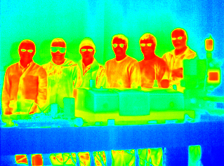
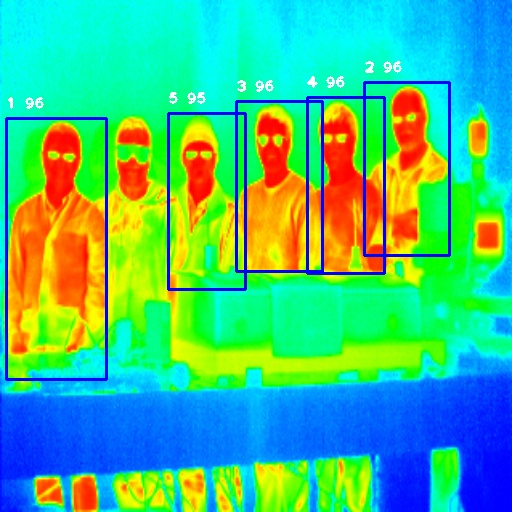

# predicting-temperature-of-people-using-infrared-images

This is a concept for predicting temperature of objects including humans from pictures taken from infrared cameras. 

# Approach
The given image is passed through the yolo network to obtain the bounding boxes around the desired object, then on a gray scale image a window of size 2*2 is slid inside the bounding box with strides of 1 and average intensity of the window is used to predict the temperature of the window. The maximum temperature encountered is considered as temperature of the object (this can be considered as correct assumption for living objects like animals since their body temperature is more than that of environments)

## Temperature Prediction
Minimum Temperature and Maximum Temperature is supposed to occur at intensity 0 and 255 respectively (both are parameters that can be provided). Then a linear scale is constructed which is used to predict the temperature for given intensity.

# Input

# Output

